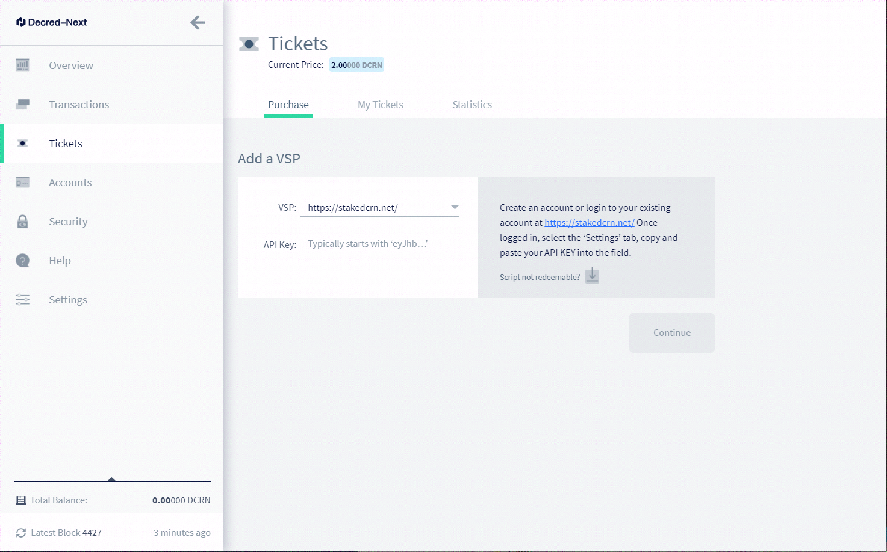
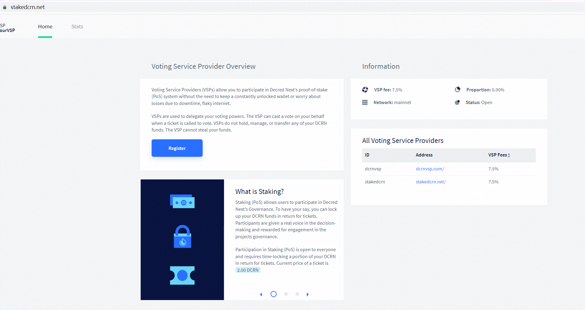
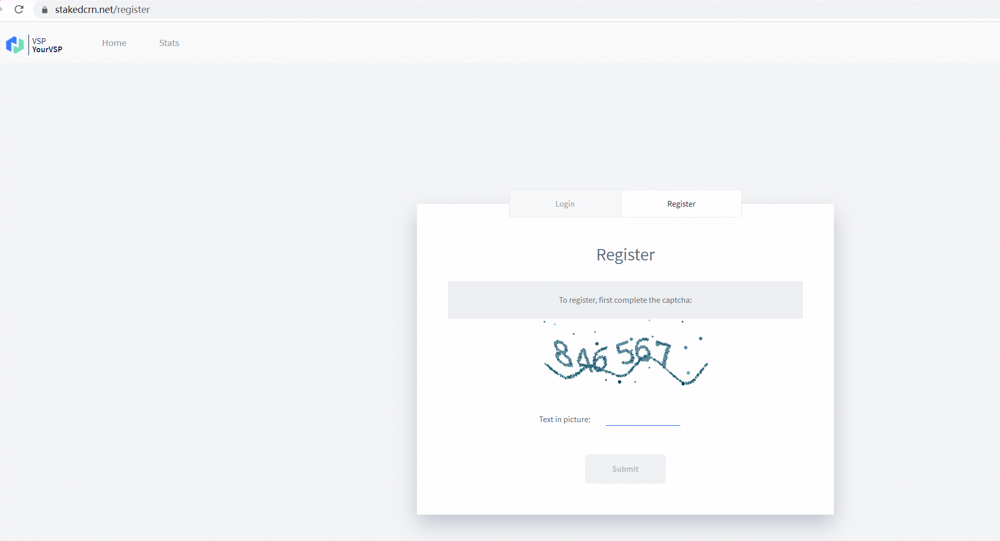
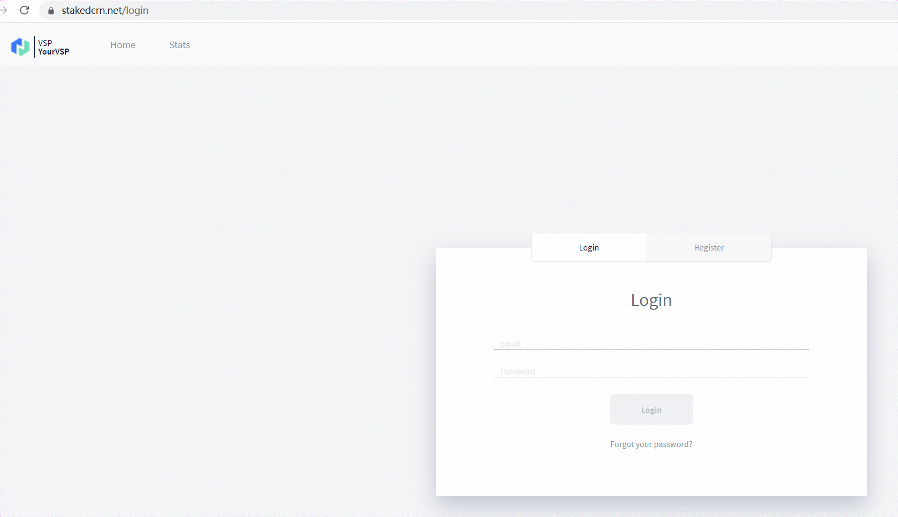
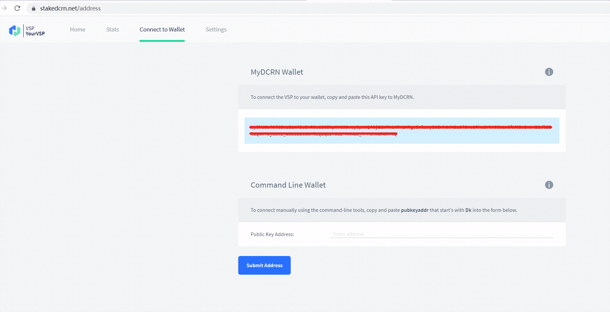
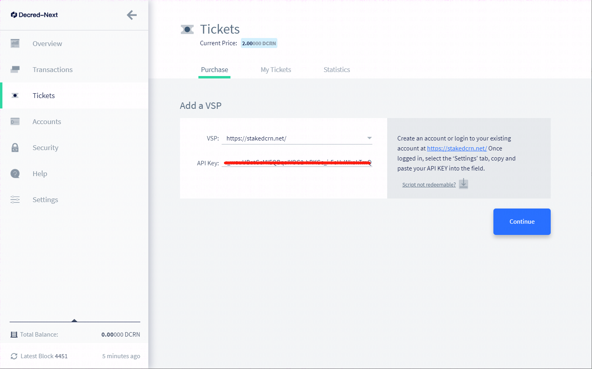
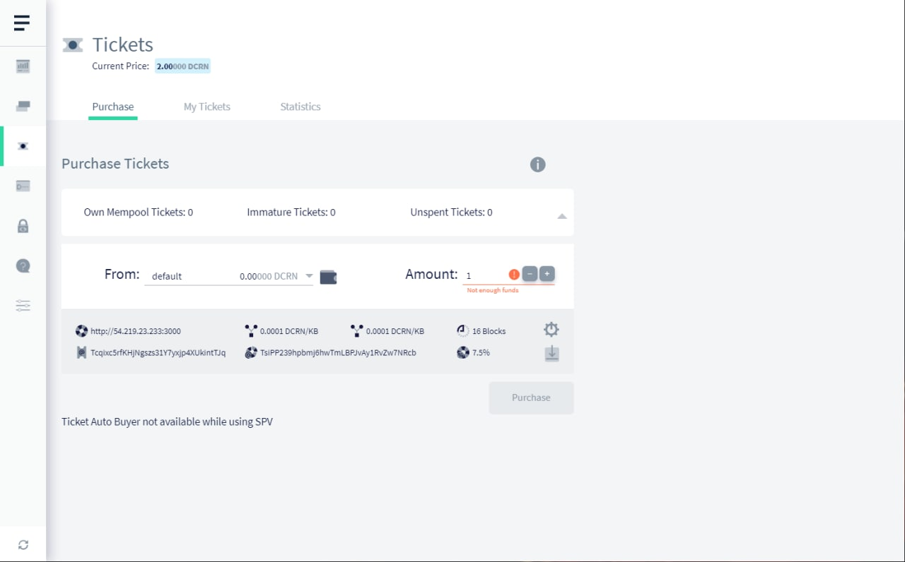
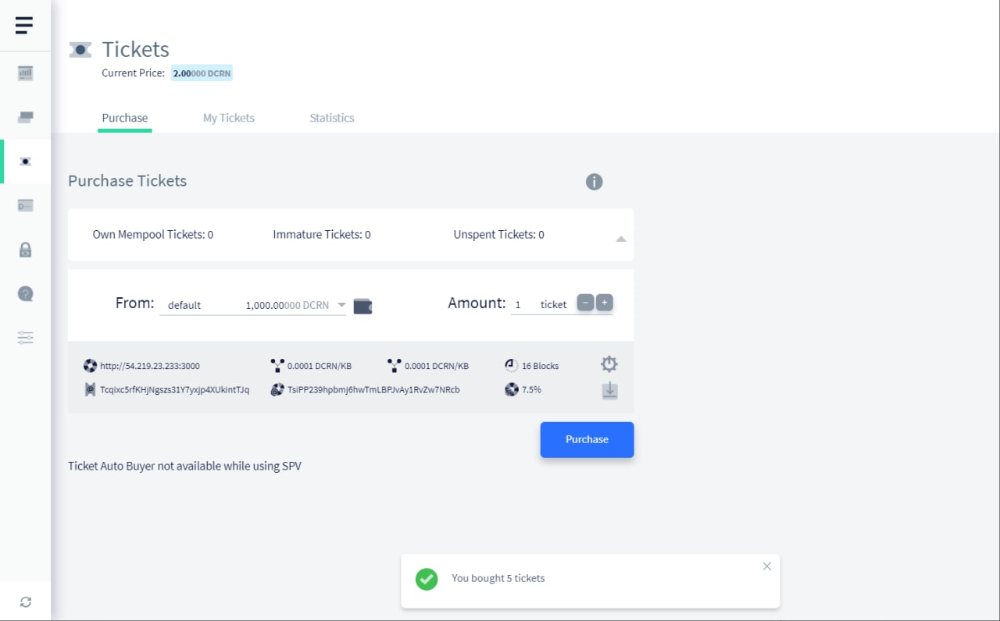
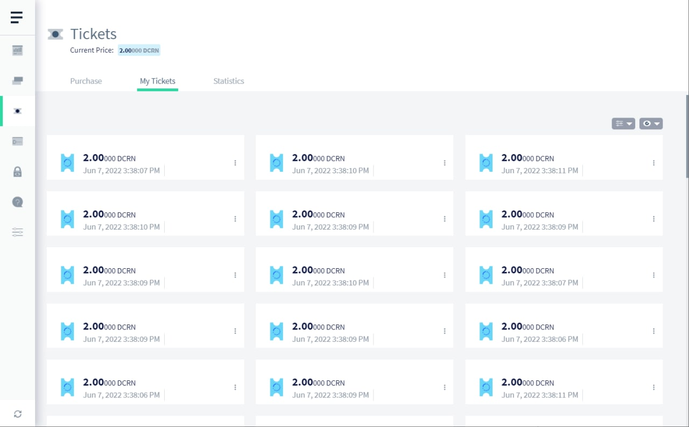

# Proof-of-Stake (PoS) Voting

**The mechanism by which ticket holders vote to approve blocks confirmed by PoW miners (thus providing a check on PoW miners), earn staking rewards, and vote on consensus rule changes and Politeia proposals.**

Proof of Stake voting is central to Decred-Next’s governance. Decred-Next holders can time-lock (or “stake”) DCRN to obtain voting tickets. Tickets are randomly called to vote on-chain; this involves both approving the work of PoW miners and voting Yes/No on any open rule change proposals. 30% of the block reward goes to the holders of the tickets that voted in that block.


## Overview
Proof-of-Stake (PoS) voting is a form of Proof-of-Stake (PoS) security, but the way Decred-Next integrates this as a complement to Proof-of-Work (PoW) mining gives it a distinctive set of roles and characteristics.

PoS voting serves a number of purposes:
1. Allowing stakeholders to vote for or against proposed changes to the Decred-Next blockchain. If stakeholders vote in support of a change, the chain will hard fork and the new feature becomes active automatically. More information on voting can be found in the Mainnet Voting Guide.
2. Providing a mechanism for stakeholders to influence Proof-of-Work (PoW) miners. Stakeholders can vote to withhold a miner’s reward even if the block conforms to the consensus rules of the network. This allows stakeholders, in principle, to discourage problematic mining behavior such as mining empty blocks.
3. For a block to be valid, it has to be signed by at least 3 of the 5 tickets that are called to vote in that block. This makes the Decred-Next blockchain more robust to certain kinds of attack, such as those which rely on secret mining.


## How Ticket Voting Works
To participate in PoS voting, stakeholders lock some DCRN in return for a ticket. An individual stakeholder can purchase one or more tickets. The amount of DCRN locked, or Ticket Price, is adjusted dynamically every 144 blocks (about 12 hours). The current ticket price can be found in MyDCRN or on data.dcrn.xyz. Every ticket owned gives its holder the ability to cast a single vote. Upon voting, each ticket returns a **small reward** plus the **original Ticket Price** of the ticket.

Tickets are selected pseudorandomly according to a Poisson distribution. 

The average time it takes for a ticket to vote is 28 days, but possibly requiring up to 142 days, with a 0.5% chance of expiring before being chosen to vote (this expiration returns the original Ticket Price without a reward). Every block mined must include a minimum of 3 votes (miners are penalized by a reward deduction if fewer than 5 votes are included).

Every block mined can also include up to 20 fresh ticket purchases. A new ticket requires 256 blocks to mature before it is entered into the Ticket Pool and can be called to vote.

There are a few important variables that you should familiarize yourself with while staking.

Every 144 blocks (about 12 hours), the stake difficulty algorithm calculates a new **Ticket Price** in an attempt to keep the Ticket Pool size near the target pool size of 40,960 tickets. This 144 block window is referred to as the StakeDiffWindowSize.

The **Ticket Price/Stake Difficulty** is the price you must pay for a ticket during a single 144 block window.

The **Ticket Pool** is the total number of tickets in the Decred-Next network.

The **Ticket Fee** (ticketfee) is the fee that must be included in the ticket purchase to incentivize Proof-of-Work (PoW) miners to include that ticket in a new block. Ticket Fee usually refers to the DCRN/kB fee rate for a ticket purchase transaction. The Ticket Fee defaults to the minimum (0.0001 DCRN/kB), which is typically sufficient.

**When a ticket is called to vote, the wallet that has voting rights for that ticket must be online.** If the wallet is not online to cast its vote, the ticket will be marked as missed and you will not receive a reward for that ticket. In practice, Solo Voters often run voting wallets on a number of servers on different continents, to minimize the chance of their tickets missing a call to vote.

**Voting Service Providers (VSPs)** offer a service whereby ticket buyers can delegate the act of voting to the VSP. The ticket-buyer instructs the VSP how their ticket should vote on any open rule change proposals, and shares voting rights with the VSP to take advantage of the voting infrastructure they provide (i.e. at least three always-online servers).

VSPs charge a fee for this service, which is paid upfront before the ticket is added to the VSPs voting wallets. This fee is generally 5% or less. A list of VSPs is maintained on dcrn.xyz. VSPs do not take custody of DCRN. By using them, you only delegate the voting rights of a ticket.


**Calculation formula of Ticket Price**
```
 targetPoolSizeAll = votesPerBlock * (ticketPoolSize + ticketMaturity)

                    curTicketPrice * curPoolSizeAll²
 nextTicketPrice = -----------------------------------
	              prevPoolSizeAll * targetPoolSizeAll

```
**Calculation formula of VSP Fee**
```

    1e4 * 542  /1000 = 5420     0.0000542 DCRN

```

**Calculation formula of Ticket Fee**
```

    1e4 * 298  /1000 = 2980     0.0000298 DCRN

```
**Calculation formula of Vote reward**
```
BlockSubsidy = 10 * 1e8
    It changes every 6,144 blocks
        BlockSubsidy = BlockSubsidy * 100
        BlockSubsidy = BlockSubsidy / 101

    ex: BlockSubsidy = 1000000000 10 DCRN
    
VoteSubsidy = BlockSubsidy * 3 / ( 10 * Number of votes ) // Number of votes is 5

    ex: VoteSubsidy = 60000000  0.6 DCRN


VSP Fees

The vsp fee is calculated from the percentage given according to the
following formula:

           ps(v+z)
    f = --------------
             s+v

    where f = absolute vsp fee as an amount
          p = proportion (e.g. 0.5000 = 50.00%)
          s = subsidy (adjusted two difficulty periods into the future)
          v = price of the ticket
          z = the ticket fees

    This can be derived from the known relation that
    ps = (f * (v+z)/(v+s)) obtained from the knowledge
    that the outputs of the vote are the amounts
    of the stake ticket plus subsidy (v+s) scaled by
    the proportional input of the stake vsp fee
    f/(v+z).

f is then adjusted for the fact that at least one subsidy reduction is
likely to occur before it can vote on a block.
    ex: VSP Fees = 3408925  0.3408925 DCRN

    ticket price + ticket fee = VSP Fees + Buyer = Total purchase of tickets
    ex:  200000000 + 5420 = 3408925 + (196596495   1.96596495 DCRN) = 200005420

buyer reward
    Buyer * (vote subsidy + ticket price)  << 32 / Total purchase of tickets  >> 32
    ex: 196596495 * ( 260000000 ) << 32 / 200005420  >> 32 = 255568517

vsp reward
    VSP Fees * (vote subsidy + ticket price)  << 32 / Total purchase of tickets  >> 32
    ex: 3408925 * ( 260000000 ) << 32 / 200005420  >> 32 = 4431482
```


## Ticket Lifecycle
Purchasing a ticket is quite simple (see below), but what happens to it after you buy it? A ticket on mainnet (testnet uses different parameters) will go through a few stages in its lifetime:

1. You buy a ticket using a MyDCRN or dcrnwallet wallet. The total cost of each single ticket transaction should be Ticket Price + Ticket Fee(ticketfee).

2. Your ticket enters the mempool. This is where your ticket waits to be mined by PoW miners. Only 20 fresh tickets are mined into each block.

3. Tickets are mined into a block, with higher Ticket Fee transactions having a higher priority. Note that the Ticket Fee is DCRN per KB of the transaction. A few common transaction sizes are 298 Bytes (a solo ticket purchase) and 539 Bytes (a pool ticket purchase).

4. A - If your ticket is mined into a block, it becomes an immature ticket. This state lasts for 256 blocks (about 20 hours). During this time the ticket cannot vote. At this point, the ticket fee is non-refundable.
B - If your ticket is not mined, both the Ticket Price and Ticket Fee are returned to the purchasing account.

5. After your ticket matures (256 blocks), it enters the Ticket Pool and is eligible for voting.

6. The chance of a ticket voting is based on a Poisson distribution with a mean of 28 days.

7. Given a target pool size of 40,960 tickets, any given ticket has a 99.5% chance of voting within 40,960 blocks (approximately 142 days, or 4.7 months). If, after this time, a ticket has not voted, it expires. You receive a refund on the original Ticket Price.

8. A ticket may miss its call to vote if the voting wallet does not respond or two valid blocks are found within close proximity of each other. If this happens, you receive a refund on the original Ticket Price.

9. After a ticket has voted, missed, or expired, the funds (ticket price and reward if applicable, minus the fee) will enter immature status for another 256 blocks, after which they are released. If a ticket is missed or expired, a ticket revocation transaction is submitted by the wallet which then frees up the locked ticket outputs. NOTE: Revocations can only be submitted for a corresponding missed ticket. You cannot revoke a ticket until it is missed.


## How to Stake/Vote
There are two ways to stake/vote: solo staking and staking using a VSP. The former method is usually more appropriate for advanced users as it requires your wallet to be up 24/7. Running your own always-online wallet is known as “Solo” Voting.

Voting Service Providers (VSPs) (formerly “Stakepools”) are available for those unable to keep a personal voting wallet online. Using a VSP is completely safe; the Decred-Next PoS protocol allows you to delegate your vote to a VSP’s always-online wallet without ever giving the VSP access to your funds.


### Solo PoS Voting
Solo PoS voting is currently only possible using the Decred-Next command line tools. 

### PoS using a Voting Service Provider (VSP)
Using a VSP does not give the VSP access to your funds. All you are doing is granting voting rights to the VSP.

Unlike Proof-of-Work (PoW) mining pools, VSPs do not pool work or rewards. The number of tickets a VSP has does not affect how regularly one’s tickets will be called and rewards received.

All VSPs run the same basic code, but they may differ in the amount of redundancy available. More redundancy equals less chance of missed votes, although all VSPs will have some missed votes as many missed votes are caused by PoW miners. This is because sometimes miners will find a solution to the next block so quickly that votes haven’t had time to propagate around the network.


## Frequently asked questions
---
1. **Do I need to be constantly connected to the network to participate in PoS?**
A wallet needs to be online 24/7 to cast votes when tickets are selected. There are two main ways to do this:
A solo staking wallet which you set up yourself and keep online all the time.
Using a Voting Service Provider (VSP) which will vote on your behalf, charging a small percentage of the PoS reward as a fee for this service.
---
2. **What is the “ticket price”?**
The price for tickets is determined by an algorithm that aims to keep the ticket pool size, which is the total amount of tickets in the PoS system ticket pool, around a target size of 40,960 tickets.
The ticket price goes up or down according to the demand for tickets, and the number of tickets currently in the pool. Every 144 blocks the algorithm adjusts the ticket price. This is called a buying window. Each block can contain 20 newly bought tickets. This means that in every buying window a maximum of 2880 tickets can be added to the PoS system ticket pool.
The ticket price is always refunded, no matter if your ticket votes, misses or expires.
---
3. **Can I cancel my ticket?**
No. The fact that funds cannot be withdrawn is a key element in Decred-Next’s PoS security and governance model. Having funds locked in tickets proves that ticket holders have “skin in the game” and are properly incentivized. Funds will be returned to the ticket holder’s wallet once the ticket has either voted or been revoked due to a missed or expired vote.
---
4. **Is Proof-of-Stake (PoS) susceptible to large exchanges using their customers’ DCRN?**
The amount of DCRN a person (or exchange) possesses doesn’t matter, only the number of tickets. Funds used to purchase tickets are locked until the ticket they purchased votes. This means that DCRN involved in PoS are effectively nontransferable. For an exchange to use their customers’ DCRN for voting, they would have to transfer them out of the wallets and lock them for up to 5 months. People would notice their balances change (DCRN locked in PoS will not show as spendable) and they would not be able to withdraw any funds so the exchange would suffer a large loss of liquidity.
Furthermore, there is a hard limit of 20 tickets added per block, so no exchange could flood the pool faster than this.
Finally, there’s a soft cap on the total number of tickets in the pool. Every 144 blocks (2880 tickets) the ticket price is adjusted based on the number of tickets in the pool and the rate that new tickets were added in the last window. Eventually the ticket price would be so high that even an exchange wouldn’t be able to buy many tickets. And remember that even if they did that their DCRN are locked so they can’t buy more when the price drops again.
---
5. **Is Proof-of-Stake (PoS) susceptible to influence from large balance holders such as the original developers?**
The pool size limits above apply here. This stops one person/group flooding the PoS pool with large numbers of their own tickets. Even if they bought up the whole pool (with huge fees) the most they would likely get is about 4000 tickets (based on previous ticket windows where the ones around 30 DCRN usually go up to 100 for the next window, and the max for the one after that is often over 300). So a large balance holder could probably buy 2 windows out. A window at 30 would be 86,400 DCRN, then the next at 100 would be 288,000 DCRN. So it would cost 374,400 DCRN to buy 5,760 tickets. With a target pool size of 40,960 tickets, 374,400 DCRN would give you about 14% of all tickets.
Now the holder could wait a couple of days for the price to drop then start buying back up again. Except that most of their funds will be locked in the ones they bought earlier (although some will have voted) so their buying power for the new window is greatly reduced. But let’s say they have super capital and bought all the DCRN on all exchanges. So they are able to buy another two windows and replace those tickets that voted and were successful in buying all the tickets (at very high fees and/or prices). Let’s say that takes them to about 25% of the tickets.
Tickets for a block are chosen with a random distribution. To force a vote to go a certain way you would need 3 out of 5 votes for a given block which is 60%. Even with that huge expenditure of capital, they are less than half way there. And a vote isn’t decided on a single block so you would need 60% of 75% of blocks in the voting period.
And THEN you still need the PoW miners to confirm the votes. If they think someone is trying to game the system, they can choose to invalidate blocks.
So basically this is close to impossible, even if a single person has a HUGE percentage of DCRN.
But then we come to the Voting Service Providers. VSPs, while not having access to any of their users’ funds, do have the ability to change votes on tickets assigned to them. This is why it is suggested that when joining a VSP, people don’t just go for the largest one. Decred-Next is short for ‘decentralized credit of next generation’ so part of the spirit of PoS is ensuring that the VSPs don’t get too large in relation to the others. However, even the largest at almost 20% would still only get on average one vote per block.
Decred-Next was specifically designed to minimize impact from both large PoW mining pools and PoS VSPs as well as individuals (including developers) with large holdings.
---
6. **What happens if less than 3 of the selected tickets vote on a block?**
Miners do not start mining for the next block until at least 3 of the selected tickets vote on the current block. If a found block does not manage to get the selected votes, the block is simply orphaned by the next block another miner finds.
For example, assume the current chain tip is at block 5,000. The voters determined by block 5,000 have already submitted their votes, so miners are chugging away looking for block 5,001. Now, a miner finds a solution for block 5,001 and submits it to the network. All of the daemons (and hence wallets) will see that 5,001 just showed up. However, the miners do not immediately start mining off of 5,001. Instead they continue mining off of 5,000 until 3+ votes for block 5,001 show up. At that point they all switch and start mining off of 5,001. If those 3+ votes never show up, another candidate block 5,001 will be found by the other miners still working on block 5,000 who will submit their (different) solution for block 5,001 to the network. Since each of these new candidate blocks for 5,001 have a different hash, different tickets are selected.
---
7. **Are vote choices set when a ticket is purchased, or when a ticket votes?**
Voting choices can be set and changed at any time after a ticket is purchased. It is only when the ticket is called to vote that the vote choice is recorded on the blockchain and can no longer be changed.
Weeks or months could elapse between a ticket being purchased and it being called to vote. A ticket could be purchased before a voting agenda even exists.
---

## MyDcrn ticket buying process

1.**Open the myDcrn program and enter the ticket buying page**


2.**Enter the VSP website to register users**


3.**Click the register button**


4.**Enter the verification code and email address to send the registration email**

5.**Enter the registered mailbox and click the registration link to complete the registration**

6.**Log in the website**


7.**Copy the wallet API key**


8.**Paste it into myDcrn**


9.**Mydcrn started buying tickets**


10.**Click buy to buy tickets**




